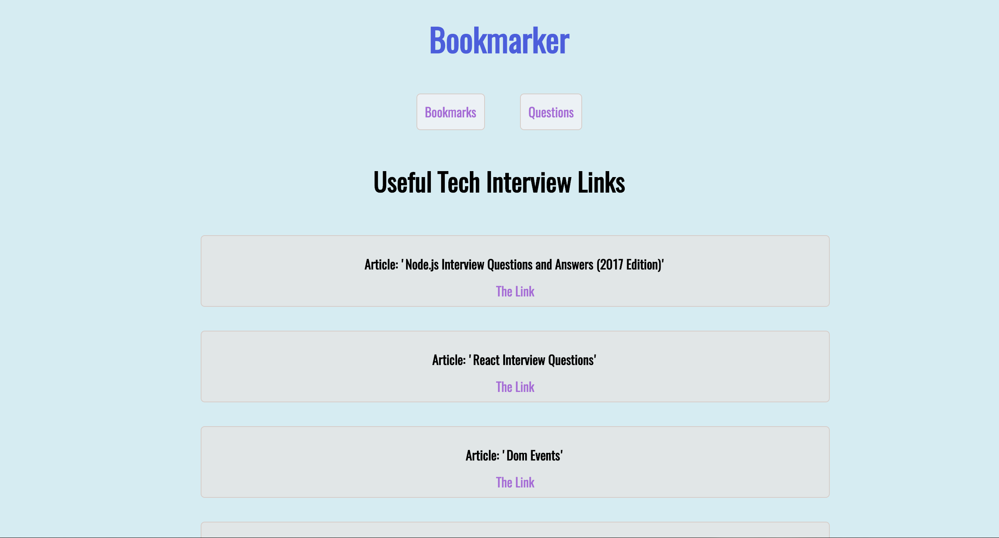

**Bookmarker**

A simple bookmark application to store job-search-related bookmarks, built in Angular 2.

This application allows the user to view, add, and delete website bookmarks and questions for technical interviews. It is designed to help prepare for such interviews by amassing a collection of resources.
